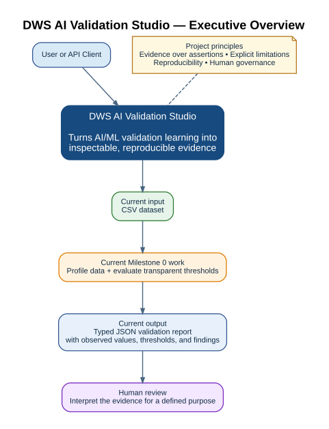

# DWS AI Validation Studio

[](https://github.com/jeborgesm/dws-ai-validation-studio/actions/workflows/ci.yml)

An enterprise-style AI/ML validation and governance platform built as a public learning and evidence repository.

## Why it exists

This project turns Python and AI/ML validation learning into visible, defensible evidence. It is deliberately more than a tutorial: each capability is supported by working code, automated tests, architecture decisions, governance documentation, limitations, and reproducible examples.

## Demonstrated and planned capabilities

- Python service development with strict typing and automated quality gates.
- Dataset profiling, validation plans, and structured findings.
- Model performance testing and error analysis.
- Model inventory, model cards, and review workflows.
- Explainability, fairness analysis, drift monitoring, and anomaly detection.
- AWS S3 and SageMaker integration.
- PostgreSQL-backed evidence and audit history.
- Power BI, DAX, Power Automate, SharePoint, JIRA, and ServiceNow integration examples.

> **Public-data boundary:** This repository uses only public, synthetic, or explicitly authorized data. It contains no proprietary, customer, or personally sensitive information.

## Milestone 0: working vertical slice

Milestone 0 already provides a runnable path:

1. Upload a CSV dataset.
2. Profile rows, columns, inferred types, missing values, uniqueness, and duplicate rows.
3. Evaluate transparent quality thresholds.
4. Return a typed JSON validation report.
5. Verify behavior through unit tests, API tests, linting, strict type checking, and CI.

## Architecture at a glance



Milestone 0 implements a deliberately small working vertical slice: a client uploads a CSV through FastAPI, the core profiler computes dataset evidence and evaluates transparent thresholds, and the API returns a typed Pydantic validation report. The target architecture expands this foundation with persistence, cloud services, governance artifacts, monitoring, and enterprise integrations.

For the visual walkthrough, start with [How to Read This Project](docs/architecture/diagrams/00-how-to-read-this-project.svg), then review the [Milestone 0 system context](docs/architecture/diagrams/02-milestone-0-system-context.svg), [component responsibilities](docs/architecture/diagrams/03-milestone-0-component-responsibilities.svg), and [validation lifecycle](docs/architecture/diagrams/04-validation-lifecycle.svg).

> **Current vs. future state:** The [target platform architecture](docs/architecture/diagrams/06-target-platform-architecture.svg) and [future AI assistance roadmap](docs/architecture/diagrams/07-future-ai-assistance-roadmap.svg) are intentionally labeled as planned concepts. They are not claims about Milestone 0 implementation.

See the [documentation map](docs/README.md) and [system context](docs/architecture/system-context.md) for the detailed architecture record.

## Quick start

Prerequisite: Python 3.12+

```bash
python -m venv .venv
# Windows PowerShell
.venv\Scripts\Activate.ps1
# Linux/macOS
source .venv/bin/activate

python -m pip install --upgrade pip
pip install -e ".[dev]"
uvicorn dws_ai_validation.main:app --reload
```

Open `http://127.0.0.1:8000/docs` for interactive OpenAPI documentation.

## First validation request

```bash
curl -X POST "http://127.0.0.1:8000/api/v1/datasets/profile" \
  -H "Content-Type: multipart/form-data" \
  -F "file=@data/samples/customer_risk_sample.csv"
```

## Quality gates

```bash
ruff check .
mypy src
pytest
```

## Documentation designed for technical defense

- [Project charter](docs/project-management/project-charter.md)
- [Foundation architecture](docs/architecture/foundation.md)
- [System context and data flow](docs/architecture/system-context.md)
- [Component responsibilities](docs/architecture/component-responsibilities.md)
- [Validation methodology](docs/quality/validation-methodology.md)
- [Testing strategy](docs/quality/testing-strategy.md)
- [Threat model](docs/governance/threat-model.md)
- [Model governance lifecycle](docs/governance/model-governance-lifecycle.md)
- [Architecture decisions](docs/decisions/)
- [Project defense guide](docs/learning/project-defense-guide.md)
- [Python for .NET engineers](docs/learning/python-for-dotnet-engineers.md)
- [Glossary](docs/glossary.md)

## Roadmap

| Milestone | Deliverable | Evidence produced |
|---|---|---|
| M0 | Python foundation and CSV profiling | API, tests, typed report, CI, architecture docs |
| M1 | Configurable validation plans and persistence | Versioned rules, PostgreSQL schema, audit events |
| M2 | Baseline classification model | Metrics, confusion matrix, error analysis, reproducibility record |
| M3 | Model inventory and model cards | Inventory records, generated model card, approval state |
| M4 | Explainability and fairness | SHAP evidence, subgroup analysis, limitations |
| M5 | Drift and anomaly monitoring | Reference distributions, alerts, monitoring report |
| M6 | AWS and SageMaker | S3 artifacts, training/deployment pipeline, registry evidence |
| M7 | Enterprise integrations | Power BI dashboard, DAX measures, Power Automate and SharePoint workflow |

## Important limitation

A passing demonstration report is not proof that a model is safe, fair, compliant, or suitable for a real decision. Validation conclusions are always purpose-, version-, data-, and threshold-specific and require human review.

## License

MIT. See [LICENSE](LICENSE).
