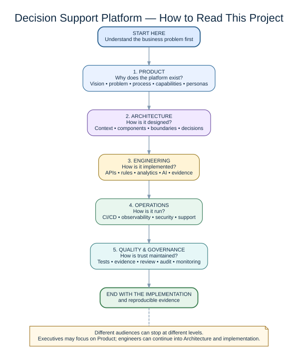

# Documentation Map

This directory is the authoritative technical and governance record for DWS AI Validation Studio. The project deliberately treats documentation as a first-class engineering deliverable because AI/ML validation work must be explainable, reproducible, reviewable, and supported by clear engineering justification.

## Start here

1. [Project charter](project-management/project-charter.md)
2. [Foundation architecture](architecture/foundation.md)
3. [System context and data flow](architecture/system-context.md)
4. [Validation methodology](quality/validation-methodology.md)
5. [Responsible use and data boundary](governance/responsible-use.md)
6. [Threat model](governance/threat-model.md)
7. [Engineering justification guide](guides/engineering-justification-guide.md)

## Visual architecture guide

The diagrams are an orientation layer over the written documentation. They do not replace the architecture decisions, implementation details, limitations, or governance records.

| Diagram | Purpose | State |
|---|---|---|
| [Executive overview](architecture/diagrams/01-executive-overview.svg) | Explains what the project is and the evidence-first idea at a glance. | Current concept |
| [Milestone 0 system context](architecture/diagrams/02-milestone-0-system-context.svg) | Shows the working CSV upload, profiling, rule evaluation, typed report, and cleanup flow. | Implemented |
| [Milestone 0 component responsibilities](architecture/diagrams/03-milestone-0-component-responsibilities.svg) | Maps API, profiler, contracts, and tests to their responsibilities. | Implemented |
| [Validation lifecycle](architecture/diagrams/04-validation-lifecycle.svg) | Shows the evidence-oriented validation cycle from input through human review. | Current method / evolving |
| [Repository structure](architecture/diagrams/05-repository-structure.svg) | Explains how source code, tests, data, documentation, and GitHub automation fit together. | Current repository |
| [Target platform architecture](architecture/diagrams/06-target-platform-architecture.svg) | Shows the planned expansion into persistence, cloud services, governance, monitoring, and integrations. | Planned |
| [Future AI assistance roadmap](architecture/diagrams/07-future-ai-assistance-roadmap.svg) | Shows projected AI-assisted documentation, review, advisory, and reporting roles with human decision authority retained. | Projected |

## Architecture decision records

Architecture Decision Records (ADRs) document not only what was chosen, but why, which alternatives were considered, and what tradeoffs were accepted.

- [ADR-0001: Modular monolith first](decisions/ADR-0001-modular-monolith.md)
- [ADR-0002: Python and FastAPI](decisions/ADR-0002-python-fastapi.md)
- [ADR-0003: Typed Pydantic contracts](decisions/ADR-0003-pydantic-contracts.md)
- [ADR-0004: Synthetic and public data only](decisions/ADR-0004-data-boundary.md)
- [ADR-0005: Evidence-first development](decisions/ADR-0005-evidence-first.md)

## Quality and operations

- [Testing strategy](quality/testing-strategy.md)
- [Definition of done](quality/definition-of-done.md)
- [Local development](operations/local-development.md)
- [Troubleshooting](operations/troubleshooting.md)
- [Glossary](glossary.md)
