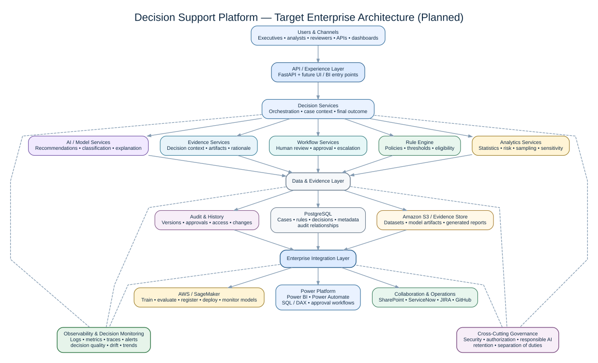
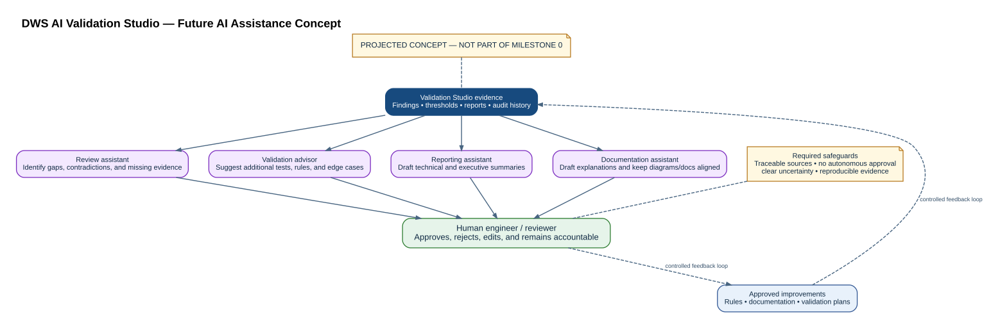

# Foundation Architecture

## Architectural intent

Milestone 0 uses a deliberately small modular architecture. The purpose is to learn Python idioms while preserving enterprise qualities: separation of concerns, typed contracts, deterministic behavior, testability, explicit failure handling, and an incremental path toward cloud deployment.

The diagram is intentionally high level. The sections below define the architectural responsibilities and boundaries that make the current implementation defensible.

## Design principles

- Keep transport, domain logic, and infrastructure responsibilities separate.
- Prefer pure, deterministic core behavior that is easy to test.
- Record observed evidence and thresholds rather than returning opaque pass/fail labels.
- Avoid premature distributed architecture.
- Keep external contracts typed and documented.
- Make deferred security and governance controls explicit.

## Components

### FastAPI transport layer

Accepts dataset uploads and returns structured validation reports. It owns transport concerns, input rejection, HTTP status behavior, and temporary-file cleanup.

### Dataset profiling and rule evaluation

Uses pandas to inspect a dataset and evaluate initial quality rules. It does not know about HTTP, persistence, cloud services, or presentation.

### Pydantic contracts

Defines stable, validated output objects for column profiles, findings, and dataset-level results. These contracts generate OpenAPI schemas and make evidence machine-readable.

## Error behavior

- Non-CSV extension: HTTP 415.
- Empty upload: HTTP 400.
- Known parsing failure: HTTP 422.
- Temporary files are removed in a `finally` block.

Unexpected failures are not deliberately swallowed because hiding defects would reduce diagnostic value. Production hardening will add structured logging, correlation identifiers, and safe error responses.

## Planned evolution

The target architecture is a roadmap, not a description of Milestone 0. Planned additions include:

- PostgreSQL stores model inventory, validation runs, findings, approvals, and audit history.
- S3 stores datasets and generated evidence artifacts.
- SageMaker supports training, registration, deployment, and monitoring.
- A governance module generates model cards and validation reports.
- Power BI consumes curated validation and monitoring data.
- Power Automate and SharePoint demonstrate human review and evidence retention.

### Projected AI assistance

AI assistance is a projected capability rather than an implemented Milestone 0 feature. The concept is to use agents or AI-assisted services to help explain evidence, identify review gaps, recommend additional validation work, and draft reports while keeping final governance decisions with a human reviewer.

## Why this remains defensible

The architecture is intentionally proportional to the current problem. It does not claim future controls are already implemented, and each planned addition is tied to a concrete capability rather than technology for its own sake.
