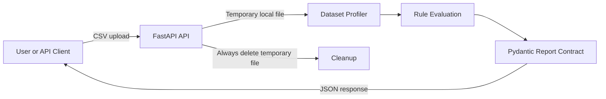
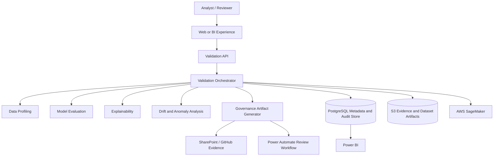

# System Context and Data Flow

## Context

DWS AI Validation Studio receives a dataset or model-related artifact, performs validation work, records findings, and produces evidence that a human reviewer can inspect. It is designed as a learning platform and portfolio reference, but follows enterprise engineering practices.

## Current Milestone 0 flow

## Target flow

## Trust boundaries

1. **Upload boundary:** Incoming content is untrusted until validated.
2. **Application boundary:** API and validation components execute with minimum required permissions.
3. **Persistence boundary:** Metadata and artifacts are stored separately because they have different security and retention needs.
4. **Cloud boundary:** AWS services require explicit identity, network, encryption, and logging controls.
5. **Human decision boundary:** Automated validation produces evidence and recommendations; it does not make final governance decisions.

## Current simplifications

Milestone 0 uses temporary local files because it is the smallest testable path. Persistence, authentication, malware scanning, object storage, and background jobs are intentionally deferred and documented as future controls rather than implied to exist.
