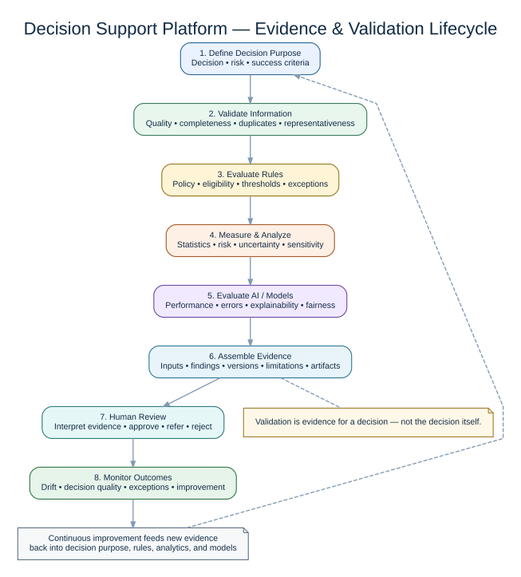

# Validation Methodology

## Purpose

Validation asks whether data, a model, and its operating context are fit for a stated purpose. It is broader than calculating accuracy and must include data quality, methodology, reproducibility, limitations, operational behavior, and governance evidence.

The lifecycle diagram emphasizes the project's evidence-first principle: validation produces inspectable evidence for human review rather than treating a single automated score as a final governance decision.

## Dataset validation dimensions

### Completeness

Measures missing values at dataset and column level. A threshold is contextual: 20% is a Milestone 0 demonstration default, not a universal standard.

### Uniqueness

Detects duplicate rows and, in future milestones, duplicate business keys.

### Validity

Future rules will evaluate allowed values, ranges, formats, and cross-field constraints.

### Consistency

Future checks will identify contradictions across fields, datasets, or time periods.

### Timeliness

Future metadata will record observation dates, extraction dates, and acceptable age.

### Representativeness

Model validation will compare the evaluation population with the intended operating population.

## Model validation dimensions

- **Correctness:** The implementation performs the intended computation.
- **Performance:** Metrics are appropriate to the use case and evaluated on unseen data.
- **Robustness:** Results remain acceptable under perturbations and edge cases.
- **Reproducibility:** Data version, code version, configuration, environment, and random seeds are recorded.
- **Explainability:** Explanations are generated and interpreted with known limitations.
- **Fairness:** Relevant subgroup behavior is examined where lawful, ethical, and supported by the data.
- **Monitoring:** Drift, degradation, anomalies, and operational failures are observable.
- **Governance:** Ownership, purpose, approvals, limitations, and review history are documented.

## Pass/fail philosophy

A validation result is not a declaration that a model is universally safe. It means the evaluated evidence met the configured criteria for a defined purpose and version. Findings retain observed values and thresholds so reviewers can challenge the decision.

## Current Milestone 0 rules

1. Each column's missing-value percentage must be less than or equal to the configured threshold.
2. Duplicate-row percentage must be less than or equal to the configured threshold.
3. Overall status passes only when every finding passes.

## Known limitations

- Data types are inferred by pandas and may not reflect business semantics.
- Duplicate rows are not the same as duplicate business entities.
- Missingness may be meaningful rather than erroneous.
- Thresholds are hard-coded defaults in Milestone 0.
- No schema contract, outlier, range, sensitive-data, or drift checks exist yet.
